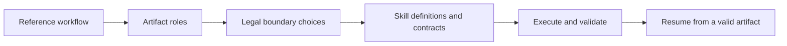

# Agent-Cut

**Reusable workflow skills with explicit artifact contracts, validators, and local repair.**

Agent-Cut studies where a scientific workflow can be divided into reusable units.
Each skill declares its input and output artifacts, binds an output validator, and
records how execution can resume after a failed intermediate result.

It includes **six workflow families** spanning tabular prediction, molecular-property
prediction, and single-cell label transfer, with **104 compiled skill definitions**.



## Run the offline example

Use Python 3.11 or later. The inspection example requires only PyYAML.

```bash
python -m venv .venv
# Activate .venv using your shell's activation command.
python -m pip install -r requirements.txt
python examples/inspect_workflows.py
```

This command enumerates legal decompositions and validates the boundaries of the
distributed skill definitions. It downloads no datasets and calls no language model.

| Workflow family | Legal partitions | Compiled definitions |
| --- | ---: | ---: |
| OpenML tabular binary prediction | 32 | 16 |
| TDC ADMET binary prediction | 32 | 16 |
| TDC ADMET regression | 32 | 20 |
| TDC toxicity prediction | 32 | 12 |
| Scanpy pancreas label transfer | 16 | 24 |
| Tabula Muris label transfer | 16 | 16 |

Definitions include different dataset splits; the count is not a count of unique algorithms.

## Method

1. Describe a workflow as an ordered sequence of artifact roles.
2. Enumerate segments whose outputs have explicit validators.
3. Score candidate partitions using artifact structure and recorded executions.
4. Compile the selected segments into skill definitions, contracts, and replay bindings.
5. Validate each output and limit recomputation to the appropriate repair region.

A reusable skill boundary and a repair restart point need not be identical. The single-cell
implementation can resume from a validated `prepared_query` artifact for a specific
`latent_or_graph_missing_required_key` failure while retaining the selected skill boundaries.

## Experimental findings

The saved single-cell comparison in
[`benchmarks/singlecell/all_fault_repair.json`](benchmarks/singlecell/all_fault_repair.json)
reports:

| Method | Mean rerun span | Final success |
| --- | ---: | ---: |
| Selected boundaries | 2.8 | 1.0 |
| Selected boundaries with a prepared-query restart | 2.6 | 1.0 |
| Fine-grained baseline | 2.6 | 1.0 |

The improvement is concentrated in one failure type. It closes the observed repair gap;
it does not demonstrate universal superiority over fine-grained skills. The saved executed
workflow utility is also tied between the selected and fine-grained single-cell partitions.
Automatic agent discovery of optimal boundaries remains an open research question.

## Run a reference workflow

Optional environments are separated by task family:

```bash
python -m pip install -r requirements-predictive.txt
python scripts/run_reference.py --family openml_tabular_binary --task credit-g
```

This command downloads the selected dataset and writes generated artifacts under `runs/`
and `results/`. Molecular tasks additionally require `requirements-molecular.txt`;
single-cell tasks require `requirements-singlecell.txt` and their source datasets.
Inspect [`configs/datasets.yaml`](configs/datasets.yaml) and
[`configs/families.yaml`](configs/families.yaml) for dataset identities and split definitions.
Dataset terms remain those of their respective providers.

Full reference workflows need their optional scientific packages and datasets. The offline
inspection and test suite check decomposition and portability without claiming to repeat
the complete predictive and single-cell experiments.

## Code map

| Location | Purpose |
| --- | --- |
| `cut/` | Segment enumeration and boundary scoring |
| `compiler/` | Skill-library compilation |
| `skills/compiled/` | Distributed skill contracts and replay bindings |
| `validators/` | Artifact and consistency checks |
| `runtime/` | Workflow evaluation, execution replay, and repair experiments |
| `pipelines/` | Reference scientific workflows |
| `benchmarks/` | Saved partition and repair results |

## Tests

```bash
python -m pip install -r requirements-dev.txt
python -m pytest
```
